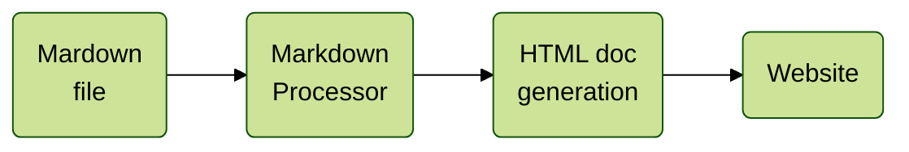

# How to write and publish documentation

## Markdown tools

Markdown is a lighweight markup language, easier to deal with than html, and designed for the web.



For creating static webpages from Markdown files:

+ <span style="color:green">MkDocs</span>
+ Jekyll
+ Read The Docs
+ ...

The generated documentation should be version-controlled and pushed on the web using:

+ <span style="color:green">GitHub</span>
+ Bitbucket
+ GitLab 
+ ...

## Creating documentation with MkDocs 

### Installation

To install MkDocs, run the following command from the command line:

```
pip install mkdocs
```

To create your documentation project (navigate to your repo folder first):

```
python -m mkdocs new my-documentation
```

The `my-documentation` just created should look like this:

```
<repo>\my-documentation
                      |
                      |- docs\index.md
                      |- mkdocs.yml
                                                                          
```
There's a single configuration file named `mkdocs.yml`, and a folder named `docs` that will contain your documentation source files.

### Local build

To preview documentation:

```
python -m mkdocs serve
```

Preview is available at `http://127.0.0.1:8000/`.

To build html documentation:

```
python -m mkdocs build
```

### Deploy pages on GitHub

```
python -m mkdocs gh-deploy
```

### Important packages

+ [`markdown-include`](https://github.com/cmacmackin/markdown-include)

### Export to pdf

`wkhtmltopdf`(https://wkhtmltopdf.org/) is abinary file that can be used to export a webpage to pdf.

```
wkhtmltopdf [URL] [OUTPUT]
```

*Note*: it is possible to implement a GitHub **action** that generate both the documentation webpage and the pdf file each time a commit is pushed.